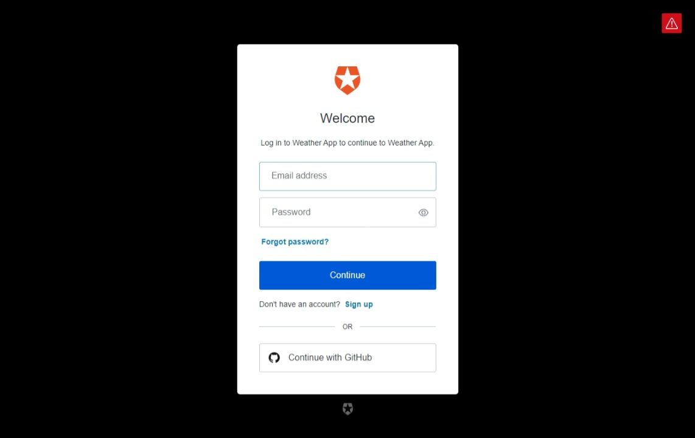

# Weather App

Fetching the weather of a city.

## Recommended IDE Setup

[VSCode](https://code.visualstudio.com/) + [Volar](https://marketplace.visualstudio.com/items?itemName=Vue.volar) (and disable Vetur) + [TypeScript Vue Plugin (Volar)](https://marketplace.visualstudio.com/items?itemName=Vue.vscode-typescript-vue-plugin).

## Customize configuration

See [Vite Configuration Reference](https://vitejs.dev/config/).

## Project Setup

1. Copy ``.env.sample`` and rename it to ``.env`` and update its values.

2. Run the ``npm install`` in command line.

### Compile and Hot-Reload for Development

```sh
npm run dev
```

### Compile and Minify for Production

```sh
npm run build
```

## App Usage

### Landing Page
This shows the landing page of the application with a login button. Clicking the login would initialize the Auth0 authentication.

### Auth0 Authentication
OAuth login options are shown here. GitHub is the only available option.

### GitHub Authorization
Authorizing the app from GitHub to access user details.

### Home Page
This shows a form where you can input a city. Submitting the form would redirect to the weather page.

### Weather Page
Weather details for the city are displayed here.

### Weather Page Error
This page could also show error based on the OpenWeather API response.


## Libraries Used
[Axios](https://github.com/axios/axios) - Promise based HTTP client for the browser and node.js
[Bootstrap](https://github.com/twbs/bootstrap) - Sleek, intuitive, and powerful front-end framework for faster and easier web development. 
[date-fns](https://github.com/date-fns/date-fns) - Modern JavaScript date utility library
[Lodash](https://github.com/lodash/lodash) - A modern JavaScript utility library delivering modularity, performance & extras.

## Third-party integrations

[Auth0](https://auth0.com/) - For OAuth Implementation
[OpenWeather](https://openweathermap.org/api) - API for Fetching Weather Data
